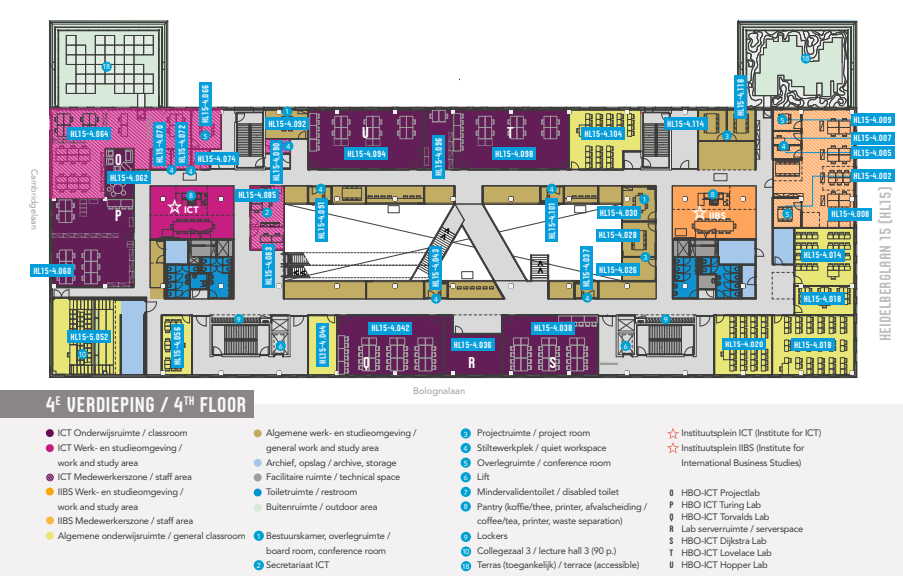
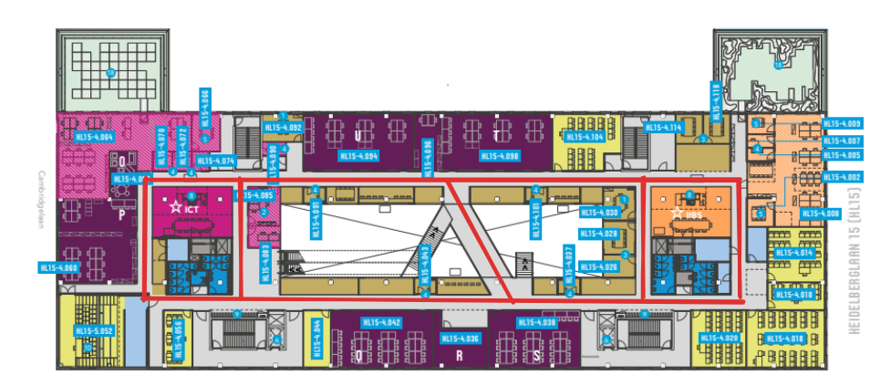
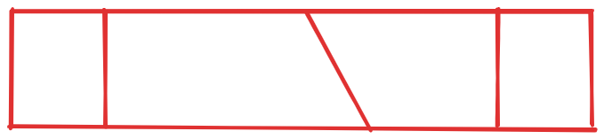
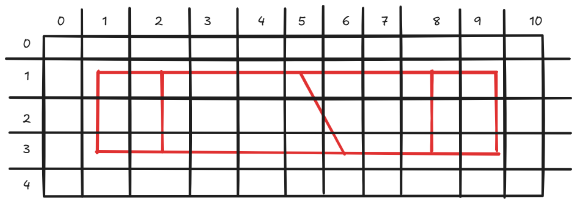
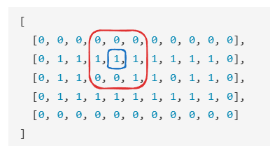

# Frontend Workshop

Voordat we met de frontend aan de slag gaan, is het belangrijk om te begrijpen wat we precies willen bouwen, en hoe de data die we daarvoor nodig hebben eruit gaat zien.

Wat we in deze workshop willen gaan bouwen is een online belevenis van de Efteling. Om exacter te zijn, willen we ons nu focussen op het gedeelte van de Efteling waar we kunnen lopen, zodat we een virtuele wandeling door het park kunnen maken.

We beginnen derhalve met de plattegrond en hoe we die om kunnen zetten naar data die we kunnen gebruiken in onze frontend.

## De Plattegrond

Stel dat de plattegrond van onze Efteling er als volgt uitziet:



### Paden

Hetgeen waar we nu in geïnteresseerd zijn, zijn de paden die we kunnen bewandelen. Deze zijn hier met een rode lijn aangegeven.



En nu doet de achtergrond er niet meer toe, we willen alleen de paden. Dus die halen we weg.



Nu we de essentie van het gedeelte van de plattegrond hebben waar wij in geïnteresseerd zijn, gaan we er een matrix overheen leggen.
We dimonsioneren de matrix zo dat de eerste en laatste rij als ook de eerste en laatste kolom allemaal geen paden bevatten.



We kunnen deze matrix nu vertalen naar een 2-dimensionale array, waarbij we de paden representeren met een `1` en de niet-paden met een `0`.

```json
[
  [0, 0, 0, 0, 0, 0, 0, 0, 0, 0, 0],
  [0, 1, 1, 1, 1, 1, 1, 1, 1, 1, 0],
  [0, 1, 1, 0, 0, 1, 1, 0, 1, 1, 0],
  [0, 1, 1, 1, 1, 1, 1, 1, 1, 1, 0],
  [0, 0, 0, 0, 0, 0, 0, 0, 0, 0, 0]
]
```

We kunnen dus nu voor elk punt in de matrix bepalen of er een pad is of niet. Zo kunnen we bijvoorbeeld bepalen dat er een pad is van het punt (4, 1) maar niet van het punt (3, 2).
En om te kunnen bepalen of waar we vanaf een bepaald punt naartoe kunnen, kunnen we kijken naar de punten eromheen. 



Dit geeft ons een deelmatrix en voor punt (4,1) is dat:

```json
[
  [0, 0, 0],
  [1, 1, 1],
  [0, 0, 1]
]
```

Onze huidige locatie staat dus in het midden van deze deelmatrix, en de punten eromheen geven aan waar we naartoe kunnen.
Op basis van deze deelmatrix kunnen we dus bepalen dat we vanuit het centrum gezien nu naar links, rechts en schuin rechts onder kunnen, maar niet naar boven, onder of schuin links onder en schuin links boven.

> [!IMPORTANT]
> Dus als we in onze frontend knoppen willen hebben om te navigeren, dan zijn we van de backend deze deelmatrix rondom een punt met x en y coördinaten nodig, zodat we kunnen bepalen welke knoppen toegestaan zijn en welke niet.

### Metadata

Met deelmatrix zouden we dus een frontend kunnen maken die ons toestaat om door het park te navigeren, maar als gebruiker weet ik dan alleen dat ik op positie x, y ben maar ik zou graag ook willen zien waar ik ben, bijvoorbeeld aan de hand van een photo. Wellicht zou ik ook andere informatie willen hebben, zoals de naam van de attractie waar ik ben etc. Dit soort informatie noemen we metadata, en die kunnen we ook toevoegen aan onze data voor een gegeven punt.

```json
{
  "x": 4,
  "y": 1,
  "metadata": {
    "name": "Droomvlucht",
    "photo": "positie-2-2.jpg"
  }
}
```

Als we voor een punt geen metadata hebben, dan kunnen we dat veld ook gewoon leeg laten of we kunnen er een lege string van maken.

```json
{
  "x": 3,
  "y": 2,
  "metadata": {
    "photo": "positie-5-2.jpg",
  }
}
```

### Uiteindelijke data

Uiteindelijk willen we voor een gegeven punt dus zowel de deelmatrix als de metadata hebben, zodat we kunnen bepalen waar we naartoe kunnen en ook wat er op die plek is.

```json
{
  "x": 4,
  "y": 1,
  "metadata": {
    "name": "Droomvlucht",
    "photo": "positie-2-2.jpg"
  },
  "deelmatrix": [
    [0, 0, 0],
    [1, 1, 1],
    [0, 0, 1]
  ]
}
```

Dit is de data die we van de backend nodig hebben om een frontend te kunnen maken die ons toestaat om door het park te navigeren en ook te zien waar we zijn. In de volgende hoofdstukken gaan we aan de slag met het bouwen van deze frontend.
